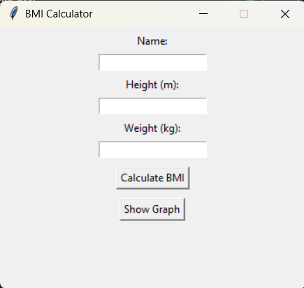

# BMI Calculator with GUI and Data Visualization

A simple Python-based **BMI Calculator** with a GUI using **Tkinter**. This project allows multiple users to:
- Enter height and weight to calculate BMI
- Store historical BMI data
- View BMI trends over time with graphs


# Technical Features

- User-friendly interface using Tkinter
- Accurate BMI calculation using the standard formula
- Automatic categorization into: Underweight, Normal, Overweight, Obese
- Data storage per user in a local `data.json` file
- BMI trend visualization using Matplotlib
- Input validation and error handling
- Lightweight and beginner-friendly code structure


# GUI Preview

> 


# Requirements

Install dependencies using:

```bash
pip install -r install.txt
```


# Run

```bash
python bmi_calc.py
```
