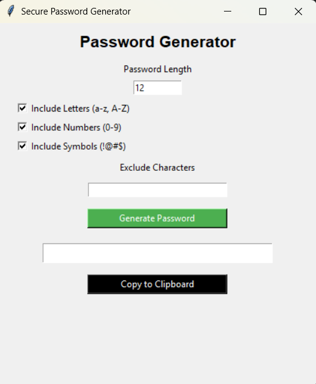

# Random Password Generator

A Python-based advanced **Password Generator** with a graphical user interface (GUI) built using `Tkinter`. This tool allows users to generate secure, customizable passwords based on length, character types, and exclusions, all within a clean and user-friendly interface.


# Features

- Easy-to-use **Graphical User Interface** (Tkinter)
- Choose password **length**
- Include **letters**, **numbers**, and **symbols** or choose according to your wish.
- **Exclude specific characters** (e.g., `0`, `O`, `l`, `1`)
- Ensures at least one of each selected character type
- Password **copied to clipboard** with a single click
- Input validation with error messages


# Screenshots

> 


# **Complete Explanation**

A full walkthrough of the project has been posted on LinkedIn.  
👉 https://www.linkedin.com/posts/anandswaroopv_oasisinfobyte-oasisinfobytefamily-internship-activity-7342625158018334721-f5s-?utm_source=social_share_send&utm_medium=member_desktop_web&rcm=ACoAAEpwJ1kBIUoA6yMGOx-pVGAKQ58bAN7s_fI


# Password Generator - Code Explanation

This is a Python-based **GUI Password Generator** built using **Tkinter**. It allows users to generate strong passwords based on selected character sets (letters, numbers, symbols), customize the password length, and exclude specific characters.


# Code Overview

| Component | Purpose |
|----------|---------|
| `PasswordGeneratorApp` | The main class that handles the entire GUI and password generation logic. |
| `setup_ui()` | Builds the GUI: entry fields, checkboxes, buttons, and labels. |
| `generate_password()` | Handles the logic for generating a secure password based on user-defined rules. Ensures one character from each selected type is included. |
| `copy_to_clipboard()` | Copies the generated password to clipboard using `pyperclip`. |


# Tools and Libraries Used

| Library      | Purpose |
|--------------|---------|
| `tkinter`    | To build the GUI interface. |
| `string`     | Provides character sets like letters, digits, and punctuation. |
| `random`     | For generating secure random passwords. |
| `pyperclip`  | Enables clipboard functionality (copy password). |
| `messagebox` | For showing user messages and errors. |


# Requirements

Install dependencies using:

```bash
pip install -r install.txt
```


# Run

```bash
python pass_gen.py
```
