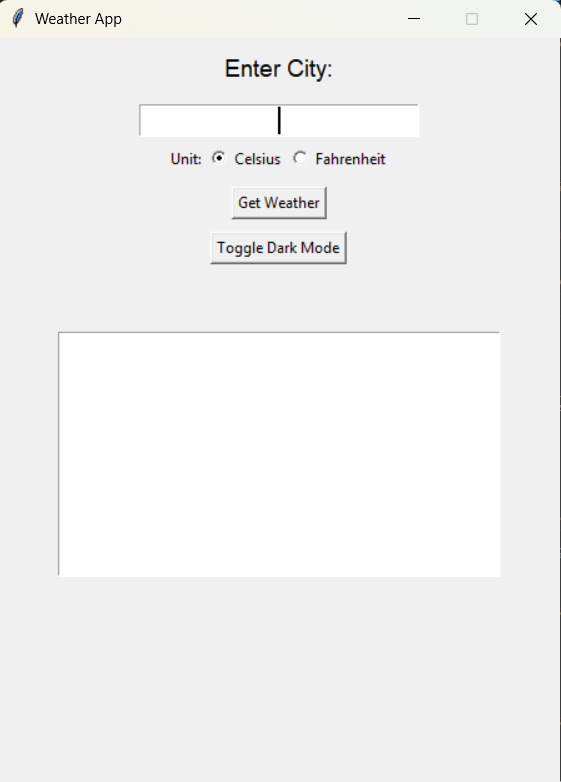

# Python Weather App (CLI + GUI)

A fully functional weather application built using **Python** that supports both **Command-Line Interface (CLI)** and **Graphical User Interface (GUI)** modes. This app fetches current weather using **OpenWeatherMap API** and forecasts using **Open-Meteo API**.


# Technical Features

- Get current weather info by city name
- Temperature in Celsius or Fahrenheit
- Next 5-hour forecast (Open-Meteo)
- Next 5-day forecast (Open-Meteo)
- Toggle Dark Mode button in GUI version
- Weather condition icons
- Uses `.env` file for API key management
- Error handling for invalid input or API errors


# GUI Preview

> 


# **Complete Explanation**

A full walkthrough and detailed breakdown of the application is available on LinkedIn.  
👉 https://www.linkedin.com/posts/anandswaroopv_oasisinfobyte-oasisinfobytefamily-internship-activity-7342789913781690368-SNps?utm_source=social_share_send&utm_medium=member_desktop_web&rcm=ACoAAEpwJ1kBIUoA6yMGOx-pVGAKQ58bAN7s_fI


# Weather App (GUI + CLI) - Code Explanation

This Python project is a dual-interface weather application that allows users to view real-time weather data, forecasts, and conditions using both a **graphical user interface (GUI)** and a **command-line interface (CLI)**. It integrates with two APIs: **OpenWeatherMap** and **Open-Meteo** to provide accurate weather details.


# Code Overview

| Component | Purpose |
|----------|---------|
| `get_weather_data(city)` | Retrieves current weather, coordinates, and conditions from OpenWeatherMap API. |
| `get_forecast(lat, lon)` | Fetches hourly and daily forecast from Open-Meteo API using coordinates. |
| `run_cli()` | Provides a clean CLI to input city and unit, and displays weather and forecasts in the console. |
| `WeatherAppGUI` | Class handling the complete GUI setup, dark mode toggle, and data visualization using `tkinter`. |
| `show_weather()` | Fetches and displays data including icon image, temperature, humidity, wind speed, hourly and daily forecast. |
| `toggle_dark_mode()` | Switches GUI between light and dark theme dynamically. |
| `k_to_c`, `k_to_f` | Utility functions to convert temperatures from Kelvin to Celsius/Fahrenheit. |


# Tools and Libraries Used

| Library      | Purpose |
|--------------|---------|
| `requests`   | To fetch API data from OpenWeatherMap and Open-Meteo. |
| `tkinter`    | For building the GUI interface. |
| `Pillow (PIL)` | For processing and displaying weather icons. |
| `dotenv`     | To securely load the API key from `.env`. |
| `datetime`   | For parsing and formatting forecast timestamps. |
| `io.BytesIO` | To load image content directly from URL. |
| `json`       | For working with structured API responses. |


# Requirements

Install dependencies using:

```bash
pip install -r install.txt
```

Change the OWM API key to your own in the .env file.


# Run

```bash
python weather_app.py
```

---
